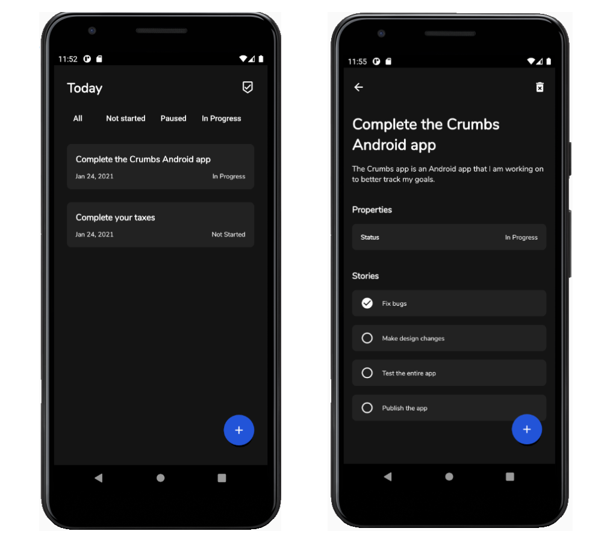

# Crumbs

Crumbs is an Android application that allows you to track your goals like a kanban board. You can create your goals as epics and assign stories as tasks that will help you complete your goal. You can monitor your progress and mark which parts have been completed.

Crumbs is built with modern Android tech stack and MVVM architecture. It will include a CI/CD pipeline and be published on the Google Play store.

 

## Release

 

## Tech Stack
- JetPack
  - ViewModel
  - LiveData
  - Room
- Architecture
  - MVVM
  - Repository pattern
